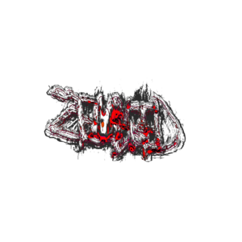

# Zenbleed



---

## Overview

Zenbleed is a cross-platform midi generator plugin built with modern C++ and the JUCE framework.

## Features

- **Cross-Platform Support**: Linux (min glibc 2.35) and Windows 10/11
- **Sample Mode**

## Installation

### Quick Start

Pre-built artifacts are available for download from
the [GitHub Actions](https://github.com/CSCI591USCA/Zenbleed/actions) tab. Select the artifact matching your operating
system.

## Building from Source

### General Prerequisites

**Required Versions (All Platforms):**

- CMake: 3.22 or later
- GCC/Clang: C++17 or later

### Linux (Debian/Ubuntu)

#### Installing Dependencies

Install required dependencies:

```bash
sudo apt-get update
sudo apt-get install build-essential libasound2-dev libjack-jackd2-dev ladspa-sdk libcurl4-openssl-dev libfreetype-dev libfontconfig1-dev libx11-dev libxcomposite-dev libxcursor-dev libxext-dev libxinerama-dev libxrandr-dev libxrender-dev libwebkit2gtk-4.1-dev libglu1-mesa-dev mesa-common-dev
```

Verify your CMake version:

```bash
cmake --version
```

#### Build Instructions

Clone and build the project:

```bash
git clone https://github.com/CSCI591USCA/Zenbleed.git --recurse-submodules
cd Zenbleed
mkdir build && cd build
cmake ..
make -j $(nproc)  # Parallel build using all available cores
make install  # Install the compiled .vst in the .vst3 directory
```

### Windows

Windows build instructions coming soon.

## Troubleshooting

### Build Failures on Linux

- Ensure all prerequisites are installed
- Update CMake to version 3.22 or later
- Clear the build directory and reconfigure: `rm -rf build && mkdir build && cd build && cmake .. && make && make install`

## License

Licensed under the GNU Affero General Public License v3.0. See [LICENSE](LICENSE) for more information.

## Support

For issues or feature requests, please open an [issue](https://github.com/CSCI591USCA/Zenbleed/issues).
