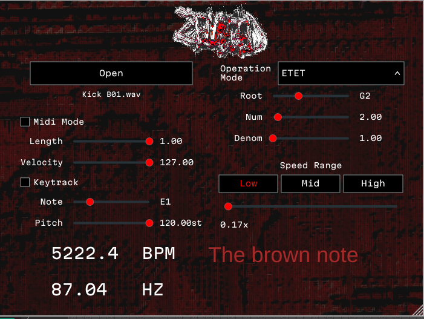

## Introduction

### History 
    (Denton) I've had the idea this plugin for a while, since I've been a bit dissatisfied with what standard DAWs are able to do with regard to extratone production.  In particular I find that MIDI is limiting when I want to create smooth speed changes.  Of course, this sort of thing can be done with a standard sampler but then you lose the flexibility of a fully controllable MIDI instrument.  This plugin represents a philosophy that extratone can be its own form of synthesis.  At the speed of extratone, the actual kick patterns you are creating become their own type of oscillator.  I wanted to create a plugin that explores this concept further by allowing more flexible ways of modulating tones than what is offered by standard tools.

### Developer Information
    Zenbleed is developed by a team of three college students for their Capstone project:

    Denton Spivey, Nick Owens, and Jacob Evans

    You can submit feedback by messaging me on discord @Dspivey or by opening an [issue on github](https://github.com/CSCI591USCA/Zenbleed/issues)

### System Requirements

#### Windows

##### Minimum:
    VST3 Compatible host

##### Recommended:
    64 bit Windows 10 or higher 
    3Ghz 4 core processor
    8gb of RAM

#### Linux

##### Minimum:
    Glibc 2.35 or later for compiled binaries.  Older glibc may work if you compile Zenbleed yourself.
    VST3 Compatible host

##### Recommended:
    64 bit distro
    3Ghz 4 core processor
    8gb of RAM

#### MacOs
    Untested

### Quick Start

Pre-built artifacts are available for download from
the [GitHub Actions](https://github.com/CSCI591USCA/Zenbleed/actions) tab. Select the artifact matching your operating
system.

The installation process follows the standard procedure for most plugins.  First extract the VST3 file (or directory if you are on Linux) and place it in whichever folder your DAW is configured to scan for VST plugins.

## Building From Source

### General Prerequisites

**Required Versions (All Platforms):**

- CMake: 3.22 or later
- GCC/Clang: C++17 or later

### Linux (Debian/Ubuntu)

#### Installing Dependencies

Install required dependencies:

```bash
sudo apt-get update
sudo apt-get install build-essential libasound2-dev libjack-jackd2-dev ladspa-sdk libcurl4-openssl-dev libfreetype-dev libfontconfig1-dev libx11-dev libxcomposite-dev libxcursor-dev libxext-dev libxinerama-dev libxrandr-dev libxrender-dev libwebkit2gtk-4.1-dev libglu1-mesa-dev mesa-common-dev
```

Verify your CMake version:

```bash
cmake --version
```

#### Build Instructions

Clone and build the project:

```bash
git clone https://github.com/CSCI591USCA/Zenbleed.git --recurse-submodules
cd Zenbleed
mkdir build && cd build
cmake ..
make -j $(nproc)  # Parallel build using all available cores
make install  # Install the compiled .vst in the .vst3 directory
```

### Windows

Windows build instructions coming soon.

## Troubleshooting

### Build Failures on Linux

- Ensure all prerequisites are installed
- Update CMake to version 3.22 or later
- Clear the build directory and reconfigure: `rm -rf build && mkdir build && cd build && cmake .. && make && make install`

# Diagrams


# User Manual



### Speed slider
- Controls the speed of the notes being output relative to the host bpm.  I.e. setting the speed to 2.0 sets the speed to twice the host BPM.

### MIDI mode checkbox
- Switches between MIDI mode and sampler mode.  In MIDI mode, there is no audio output but only MIDI output.  In sampler mode, there is no MIDI output but rather an audio sample is triggered internally.

### Open button
- This button allows a user to select a sample file.  Zenbleed will remember which file was loaded every time you restart your DAW.